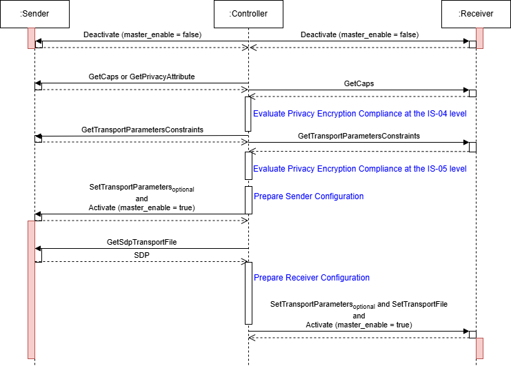
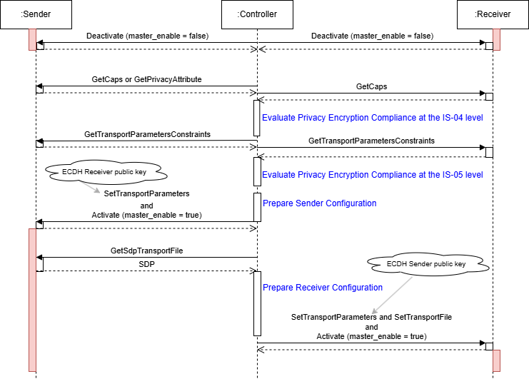

# AMWA BCP-005-03: NMOS With IPMX Privacy Encryption
{:.no_toc}
{:toc}

_(c) AMWA 2025, CC Attribution-NoDerivatives 4.0 International (CC BY-ND 4.0)_

## Introduction

The Privacy Encryption Protocol (PEP) is defined by the [VSF][] technical recommendation [TR-10-13][]. It specifies a method for generating cryptographic keys used in the encryption, decryption, and authentication of media content transmitted over multicast and unicast networks. PEP is designed to support multiple transport protocol adaptations. The default adaptation, defined in the [TR-10-13][] technical recommendation, addresses privacy encryption of media streams using the RTP streaming protocol. Additionally, the [VSF][] technical recommendation [TR-10-14][] defines an adaptation for the USB-IP streaming protocol.

This document focuses on the application of PEP within an NMOS environment. Detailed information about PEP itself is provided in the [TR-10-13][] technical recommendation.

While the Privacy Encryption Protocol (PEP) is primarily specified for IPMX streaming environments, it may also be utilized in non-IPMX contexts by devices implementing the [TR-10-14][] technical recommendation alongside compatible transport protocol adaptations.

## Use of Normative Language

The key words "MUST", "MUST NOT", "REQUIRED", "SHALL", "SHALL NOT", "SHOULD", "SHOULD NOT", "RECOMMENDED", "MAY", and "OPTIONAL" in this document are to be interpreted as described in [RFC 2119][RFC-2119].

## Definitions

The NMOS terms 'Controller', 'Node', 'Source', 'Flow', 'Sender', 'Receiver' are used as defined in the NMOS Glossary.

The term 'PSK' refers to a Pre-Shared Key that serves as the root secret for the derivation of encryption and authentication keys in the privacy encryption process.

The term 'PEP' refers to the Privacy Encryption Protocol, defined in the [TR-10-13][] technical recommendation for IPMX.

The term 'ECDH' refers to the Elliptic Curve Diffie-Hellman key agreement algorithm.

## Compliance

A Node MUST comply with all strict requirements introduced by `shall` clauses in [TR-10-13][]. Some of these requirements are restated in this specification to emphasize their importance, without altering their original normative scope. This specification MAY define additional values for the `protocol`, `mode`, and `ecdh_curve` parameters beyond those specified in [TR-10-13][], [TR-10-14][], or other VSF/IPMX technical recommendations. The inclusion of these additional values MUST NOT be interpreted as violating any `shall` clause in the referenced technical recommendations.

A Node MUST comply with the non-strict requirements introduced by `should` and `may` clauses in [TR-10-13][], where such requirements are explicitly elevated to strict requirements through a `MUST` clause in this specification.

A Node MUST comply with new requirements introduced by this specification that are not present in [TR-10-13][].

## General Provisions

A Node that is capable of transmitting privacy-encrypted streams using the Privacy Encryption Protocol MUST expose Source, Flow, and Sender resources in the IS-04 Node API.

A Node that is capable of receiving privacy-encrypted streams using the Privacy Encryption Protocol MUST expose Receiver resources in the IS-04 Node API.

A Node compliant with this specification MUST implement [IS-04][] v1.3 or higher and [IS-05][] v1.1 or higher.

## PSK Provisioning

As indicated in [TR-10-13][], the provisioning of PSK(s) in devices supporting the Privacy Encryption Protocol (PEP) is under the control of the device manufacturer.

Refer to the "Key Distribution" section of [TR-10-13][] for more details about the key distribution and provisioning processes.

The provisioning of PSKs is intentionally under manufacturer control, providing flexibility in implementation methods to support diverse deployment environments and security requirements.

### Identification

A PSK has a value and a size (128, 256, or 512 bits). Each PSK is identified by a unique `key_id`. This uniqueness ensures unambiguous identification of each PSK in use, reducing security risks associated with key duplication. The provisioning process ensures that, for a given `key_id`, all devices under a common administrative authority receive the same PSK value and size.

> Note: The [TR-10-13][] technical recommendation includes explicit requirements regarding the identification of the PSK size in the vendor-specific PSK provisioning API.

### Association

Each Sender using privacy encryption MUST be associated with a provisioned PSK via its `key_id`. Each Receiver using privacy encryption MUST be associated with a set of provisioned PSKs, identified by their `key_id` values. 

A Sender MUST populate the `ext_privacy_key_id` extended transport parameter in the IS-05 `active`, `staged` and `constraints` endpoints with the `key_id` of its associated PSK. A Sender that is not associated with a PSK MUST NOT expose the IS-05 extended transport parameters of the Privacy Encryption Protocol.

A Receiver MUST populate the `ext_privacy_key_id` extended transport parameter in the IS-05 `constraints` endpoint with all acceptable `key_id` values. At activation time, a Receiver using privacy encryption becomes associated with one of the provisioned PSKs through the `ext_privacy_key_id` extended transport parameter. A Receiver MUST fail activation if the provided `key_id` is not provisioned in the device or is not listed in the Receiver's `ext_privacy_key_id` transport parameter constraints. A Receiver that is not associated with any PSK MUST NOT expose the IS-05 extended transport parameters of the Privacy Encryption Protocol.

## Enabling/Disabling Privacy Encryption

As indicated in [TR-10-13][], the enabling and disabling of privacy encryption in devices supporting the PEP technology is under the control of the device manufacturer.

The IS-05 NMOS API MUST NOT allow to change the state (enabled or disabled) of privacy encryption.

Refer to the "SDP Transport File Parameters / NMOS Transport Parameters" section of [TR-10-13][] for further details on how privacy encryption is enabled or disabled.

The enabling and disabling of privacy encryption is intentionally under manufacturer control, providing flexibility in implementation methods to support diverse deployment environments and security requirements.

> Note: The security postulate for a Sender is that privacy-encrypted content remains protected and is never transmitted in clear by any Sender within a device. For a Receiver, the postulate is that content can be trustworthy only when received with privacy encryption, requiring that privacy-encrypted content is never composited, mixed, or multiplexed with content received in clear by other Receivers.

> Note: Privacy encryption is not a content protection mechanism, and providing access to a low-quality stream violates the privacy objective.

## Parameters

The [TR-10-13][] technical recommendation defines the following parameters, which are accessible both as IS-05 extended transport parameters (including constraints), and as `privacy` attribute parameters in SDP transport files.

For transport protocols using an SDP transport file: a Sender MUST communicate privacy encryption parameters in the SDP transport file associated with a privacy-encrypted stream, and MUST also communicate these parameters using the extended NMOS transport parameters.

For transport protocols that do not use an SDP transport file: a Sender or Receiver MUST communicate the privacy encryption parameters using the extended NMOS transport parameters.

Transport Parameter Name | Type | SDP Name | Sender | Receiver
 --- | --- | --- | --- | --- 
ext_privacy_protocol | string | protocol | r/w | r/w
ext_privacy_mode | string | mode | r/w | r/w
ext_privacy_iv | string | iv | read-only | r/w
ext_privacy_key_generator | string | key_generator | read-only | r/w
ext_privacy_key_version | string | key_version | read-only | r/w
ext_privacy_key_id | string | key_id | read-only | r/w
ext_privacy_ecdh_sender_public_key | string | - | read-only | r/w
ext_privacy_ecdh_receiver_public_key | string | - | r/w | read-only
ext_privacy_ecdh_curve | string | - | r/w | r/w

### IS-05 Transport Parameters

A Sender/Receiver implementing [TR-10-13][] MUST provide the following extended transport parameters in the IS-05 `active`, `staged` and `constraints` endpoints:
- `ext_privacy_protocol`
- `ext_privacy_mode`
- `ext_privacy_iv`
- `ext_privacy_key_generator`
- `ext_privacy_key_version`
- `ext_privacy_key_id`

A Sender/Receiver implementing [TR-10-13][] and supporting ECDH modes MUST also provide the following extended transport parameters in the IS-05 `active`, `staged`, and `constraints` endpoints: 
- `ext_privacy_ecdh_sender_public_key`
- `ext_privacy_ecdh_receiver_public_key`
- `ext_privacy_ecdh_curve`

The `ext_privacy_*` transport parameters MAY be used with any transport supporting privacy encryption and having a protocol adaptation specified in [TR-10-13][], [TR-10-14][], other VSF/IPMX technical recommendations, or this specification.

### IS-05 Transport Parameters Constraints

Each `ext_privacy_*` transport parameter MUST have an associated constraint that either indicates that the parameter is unconstrained, allowing any valid value, or that it is constrained to a specific set of values. A parameter identified as `read-only` in the parameter definitions table MUST always be constrained to a single value. A Sender/Receiver MUST fail activation if any IS-05 `ext_privacy_*` transport parameter violates its defined constraints.

The `constraints` endpoint of the parameters `ext_privacy_protocol` and `ext_privacy_mode` on both Senders and Receivers MUST enumerate all  supported protocols and modes. These parameters MUST NOT be unconstrained, and their constraints MUST NOT change when the `master_enable` attribute of a Sender/Receiver `active` endpoint is `true`.

The `constraints` endpoint of the parameter `ext_privacy_ecdh_curve` on both Senders and Receivers MUST enumerate all supported curves. This parameter MUST NOT be unconstrained, and its constraints MUST NOT change when the `master_enable` attribute of a Sender/Receiver `active` endpoint is `true`.

> Note: The constraints on the parameters `ext_privacy_protocol`, `ext_privacy_mode`, and `ext_privacy_ecdh_curve` are expected to remain the same unless the device's Privacy Encryption Protocol support is reconfigured by a User through a vendor-specific mechanism.

### Protocol

The `protocol` parameter MUST be one of the following:
- "RTP"
- "RTP_KV"
- "USB"
- "USB_KV"
- "NULL"

If privacy encryption is disabled or not supported by a Sender/Receiver, and the `ext_privacy_*` transport parameters are present, the "NULL" protocol MUST be used for the `ext_privacy_protocol` transport parameter in the `active` and `staged` endpoints to indicate that privacy encryption is not available or is disabled. The associated constraints MUST allow only the "NULL" protocol when the `ext_privacy_protocol` parameter is "NULL".

Note: The string "NULL" is not equivalent to the JSON `null` value.

The "RTP" `protocol` MUST be supported by all devices implementing [TR-10-13][] for the `urn:x-nmos:transport:rtp`, `urn:x-nmos:transport:rtp.mcast`, and `urn:x-nmos:transport:rtp.ucast` transports.

The "RTP_KV" `protocol` MAY be supported by devices supporting the "RTP" `protocol`.

The "USB_KV" `protocol` MUST be supported by all devices implementing [TR-10-13][] and [TR-10-14][] for the `urn:x-nmos:transport:usb` transport.

The "USB" `protocol` MAY be supported by devices supporting the "USB_KV" `protocol`.

### Mode

If privacy encryption is disabled or not supported by a Sender/Receiver, and the `ext_privacy_*` transport parameters are present, the "NULL" mode MUST be used for the `ext_privacy_mode` transport parameter in the `active` and `staged` endpoints to indicate that privacy encryption is not available or is disabled. The associated constraints MUST allow only the "NULL" mode when the `ext_privacy_mode` parameter is "NULL".

Note: The string "NULL" is not equivalent to the JSON `null` value.

#### For protocols "RTP" and "RTP_KV"
The `mode` parameter MUST be one of the following:
- "AES-128-CTR"
- "AES-256-CTR"
- "AES-128-CTR_CMAC-64"
- "AES-256-CTR_CMAC-64"
- "AES-128-CTR_CMAC-64-AAD"
- "AES-256-CTR_CMAC-64-AAD"
- "ECDH_AES-128-CTR"
- "ECDH_AES-256-CTR"
- "ECDH_AES-128-CTR_CMAC-64"
- "ECDH_AES-256-CTR_CMAC-64"
- "ECDH_AES-128-CTR_CMAC-64-AAD"
- "ECDH_AES-256-CTR_CMAC-64-AAD".

The "AES-128-CTR" `mode` MUST be supported by all devices implementing the "RTP" or "RTP_KV" protocols.

A Sender configured with a 256-bit or 512-bit PSK MUST support only modes based on AES-256. A Sender configured with a 128-bit PSK MAY support modes based on AES-128, AES-256, or both.

> Note: If the constraints on the IS-05 `ext_privacy_mode` transport parameter of a Sender only allow modes based on AES-128, it indicates that only 128-bit PSKs are used.

A Receiver configured with a 256-bit or 512-bit PSK MUST support modes based on AES-256. A Receiver configured with a 128-bit PSK MUST support modes based on AES-128. A Receiver MAY support both AES-128 and AES-256-based modes simultaneously. A Receiver MUST fail activation if a `key_id` associated with a 256-bit or 512-bit PSK is used with a `mode` that is not based on AES-256.

> Note: If the constraints on the IS-05 `ext_privacy_mode` transport parameter of a Receiver only allow modes based on AES-128, it indicates that only 128-bit PSKs are allowed.

The PEP "urn:ietf:params:rtp-hdrext:PEP-Full-IV-Counter" and "urn:ietf:params:rtp-hdrext:PEP-Short-IV-Counter" RTP Extension Headers MUST be declared in the SDP transport file. The declaration MUST be performed as per [RFC-8285][], using the "sendonly" direction.

#### For protocol "USB" and "USB_KV"
The `mode` parameter MUST be one of the following:
- "AES-128-CTR_CMAC-64-AAD"
- "AES-256-CTR_CMAC-64-AAD"
- "ECDH_AES-128-CTR_CMAC-64-AAD"
- "ECDH_AES-256-CTR_CMAC-64-AAD"

The "AES-128-CTR_CMAC-64-AAD" `mode` MUST be supported by all devices implementing the "USB" or "USB_KV" protocols.

### Elliptic Curve Diffie-Hellman (ECDH)

The ECDH mode allows **Perfect Forward Secrecy**.

The `ecdh_curve` parameter MUST be one of the following: "secp256r1", "secp521r1", "25519", "448", or "NULL".

If the ECDH modes are not supported by a Sender/Receiver and the `ext_privacy_*` transport parameters are present, the "NULL" curve MUST be used for the `ext_privacy_ecdh_curve` transport parameter in the `active` and `staged` endpoints to indicate that ECDH modes are not available. The associated constraints MUST allow only the "NULL" curve when the `ext_privacy_ecdh_curve` parameter is "NULL".

The "secp256r1" `ecdh_curve` MUST be supported by all devices that implement ECDH modes.

The ECDH functionality is available exclusively through the IS-05 extended transport parameters. There are no ECDH-related parameters defined in the `privacy` attribute of an SDP transport file. ECDH modes of operation are optional, and support for these ECDH-based modes is not required for conformance with [TR-10-13][], [TR-10-14][], or other VSF/IPMX technical recommendations.

> Note: A Sender/Receiver generates a new public key whenever it explicitly or implicitly becomes inactive.

## IS-04, IS-05, IS-11 Senders

A Sender compliant with this specification MUST provide a `privacy` Sender attribute to indicate that privacy encryption and the PEP protocol are used by the Sender. This attribute MUST be `true` if a `privacy` attribute is present in the Sender's SDP transport file, and MUST be `false` if no `privacy` attributes are present. If an SDP transport file is not currently available because the Sender is inactive, the `privacy` attribute indicates whether such a file would contain a `privacy` attribute if the Sender were active. If the Sender's transport protocol does not use an SDP transport file, the attribute indicates whether privacy encryption and the PEP protocol are used by the Sender. 

A Sender implementing privacy encryption and the PEP protocol MUST provide IS-05 `ext_privacy_*` extended transport parameters and associated constraints that specify the extent of support for the features defined in [TR-10-13][].

If the Sender's `privacy` attribute is `false`, the `ext_privacy_protocol` and `ext_privacy_mode` transport parameters MUST be "NULL".
If the Sender's `privacy` attribute is `true`, the `ext_privacy_protocol` and `ext_privacy_mode` transport parameters MUST NOT be "NULL".

> Note: A Sender not providing the `privacy` attribute is either not supporting privacy encryption and the PEP protocol, or declaring itself as not implementing this specification.

A Sender MAY provide a `urn:x-nmos:cap:transport:privacy` capability to indicate that privacy encryption and the PEP protocol are supported. A Sender MAY support either the `true` or `false` value. 

> Note: A Sender is not allowed by [TR-10-13][] to support both values. An NMOS API is not allowed to change the enabling or disabling of privacy encryption.

A Controller MAY use a Sender's `urn:x-nmos:cap:transport:privacy` capability and IS-05 `ext_privacy_*` transport parameters constraints to verify Receivers compatibility with a Sender. If necessary, it MAY constrain the Sender (within its declared constraints) to make it compliant with the Receivers. 

A Sender MUST NOT list the `urn:x-nmos:cap:transport:privacy` capability in its IS-11 `constraints/supported` endpoint. As such, a Controller cannot constrain the Sender's `urn:x-nmos:cap:transport:privacy` capability, as privacy encryption is a protection mechanism under the control of the Sender only. However, a Controller MAY select values for the Sender's IS-05 `ext_privacy_*` transport parameters within the limits of their associated constraints.

> Note: A Sender is configured to produce either privacy-encrypted streams or non-encrypted streams. The `urn:x-nmos:cap:transport:privacy` capability indicates the current configuration of the Sender.

### SDP Transport File

The `privacy` attribute of [TR-10-13][] is not yet registered with IANA. If it were, the definition would indicate "Usage Level: session, media", meaning that a session-level `privacy` attribute serves as the default for any media-level `privacy` attribute that is not explicitly specified. An SDP transport file MAY provide the `privacy` information at either the session-level or the media-level.

The PEP specification uses the expression "a privacy session attribute or a number of privacy media attributes" to clearly indicate "Usage Level: session, media".

### Consistency

If the `urn:x-nmos:cap:transport:privacy` capability allows only the value `true`, then the Sender's associated SDP transport file, if any, MUST include a `privacy` attribute, and the IS-05 `ext_privacy_protocol` and `ext_privacy_mode` transport parameters MUST have values other than "NULL".

If the `urn:x-nmos:cap:transport:privacy` capability allows only the value `false`, then the Sender's associated SDP transport file, if any, MUST NOT include a `privacy` attribute, and the IS-05 `ext_privacy_protocol` and `ext_privacy_mode` transport parameters, if present, MUST have the value "NULL".

The `urn:x-nmos:cap:transport:privacy` capability MUST NOT allow both `true` and `false` values.

## IS-04, IS-05, IS-11 Receivers

A Receiver implementing privacy encryption and the PEP protocol MUST provide IS-05 `ext_privacy_*` extended transport parameters and associated constraints that specify the extent of support for the features defined in [TR-10-13][].

A Receiver MUST provide a `urn:x-nmos:cap:transport:privacy` capability to indicate support for Senders that use privacy encryption and the PEP protocol. A capability value of `true` indicates that privacy encryption and the PEP protocol are supported, while a value of `false` indicates that they are not supported. A Receiver MAY support either the `true` or `false` value.

> Note: A Receiver is not allowed by [TR-10-13][] to support both values. An NMOS API is not allowed to change the state (enabled or disabled) of privacy encryption.

## Controller

A Controller MUST verify Receivers' compliance with an active Sender using privacy encryption and the PEP protocol. 

A Controller establishes that an active Sender is using privacy encryption and the PEP protocol by checking the Sender's `privacy` attribute, or by checking the Sender’s SDP transport file for a `privacy` attribute, or by checking the Sender's `urn:x-nmos:cap:transport:privacy` capability, or by verifying the Sender's IS-05  `ext_privacy_*` extended transport parameters at the `active` endpoint.

The Sender's `privacy` attribute being set to `true` or the presence of the `privacy` attribute in the SDP transport file, indicates that the stream is privacy-protected. 

Similarly, the Sender's IS-04 `urn:x-nmos:cap:transport:privacy` capability, enumerating the value `true`, indicates that the stream is privacy-protected. 

Finally, the presence of the Sender's IS-05 `ext_privacy_protocol` and `ext_privacy_mode` transport parameters at the `active` endpoint with a value other than "NULL" indicate that the stream is privacy-protected.

When considering an inactive Sender, a Controller MUST NOT rely on the content of the SDP transport file as it MAY NOT be available until the Sender becomes active.

Only Receivers that support privacy encryption and the PEP protocol MAY consume such streams.

A Controller is responsible for assessing Receivers compatibility with an active Sender with respect to privacy encryption. This process is performed at both the IS-04 and IS-05 levels. 

A Controller detecting non-compliance with an active Sender at the IS-04 level using the Sender's `privacy` attribute or `urn:x-nmos:cap:transport:privacy` capability, and the Receiver's `urn:x-nmos:cap:transport:privacy` capability MUST prevent activation and SHOULD notify the User.

A Controller detecting compliance with an active Sender at the IS-04 level using the Sender's `privacy` attribute or `urn:x-nmos:cap:transport:privacy` capability, and the Receiver's `urn:x-nmos:cap:transport:privacy` capability MUST perform a final compatibility check using the Sender's and Receivers' IS-05 `ext_privacy_*` transport parameters and associated constraints.

A Controller MUST ensure that the `protocol` and `mode` parameters are identical between the Sender and all subscribing or connecting Receivers. If an ECDH `mode` is used, the Controller MUST also ensure that the `ecdh_curve` parameter is identical between the Sender and the subscribing or connecting Receiver. A Controller MAY constrain the Sender with `protocol`, `mode` and `curve` privacy encryption parameters compatible with the Receivers. A Controller MUST forward the Sender's `iv`, `key_generator`, `key_version`, and `key_id` parameters to all subscribing or connecting Receivers. If an ECDH `mode` is used, the Controller MUST exchange the ECDH `public_key` parameters between the peers.

If a mismatch is detected in the `protocol`, `mode`, or `ecdh_curve` parameters, the Controller MUST prevent activation and SHOULD notify the User.

> Note: IS-11 operates at the IS-04 capabilities/constraints level and cannot be used to constrain privacy encryption, which is managed using IS-05.

A Controller MAY perform the compatibility checks limited to the IS-05 level for Senders and Receivers that do not implement this specification. These are Senders not providing the `privacy` attribute nor the `urn:x-nmos:cap:transport:privacy` capability, and Receivers not providing the `urn:x-nmos:cap:transport:privacy` capability. Such Senders and Receivers MAY still be compliant with [TR-10-13][], and provide privacy encryption through IS-05 transport parameters and the SDP transport file.

### IS-05 Sender Activation

The effective values of the Sender's read-only IS-05 `ext_privacy_*` transport parameters `iv`, `key_generator`, `key_version`, and `key_id`, as well as the associated `privacy` attribute parameters in the Sender's SDP transport file, are not fixed until activation, when `master_enable` becomes `true` at the `active` endpoint. A Controller MUST NOT assume final values for a Sender's IS-05 `ext_privacy_*` transport parameters or the Sender's SDP transport file `privacy` attribute parameters prior to activation.

The values of the `privacy` attribute parameters in the SDP transport file of an active Sender MUST match the values of the active `ext_privacy_*` transport parameters of that active Sender.

The [TR-10-13][] expression "becomes inactive", in the context of the ECDH private/public key pair, MUST be interpreted as an activation with `master_enable` set to `false`, resulting in `master_enable` remaining or becoming `false` at the `active` endpoint of a Sender.

> Note: In other non-ECDH contexts, the expression "becomes inactive" is caused by either (a) internally becoming momentarily inactive during an activation where `master_enable` is set to `true`, resulting in `master_enable` remaining `true` at the `active` endpoint of a Sender (re-activation), or (b) becoming inactive during an activation with `master_enable` set to `false`, resulting in `master_enable` remaining or becoming `false` at the `active` endpoint of a Sender (de-activation).

During an activation (`master_enable` becomes true) or re-activation (`master_enable` remains true), a Sender MAY change all privacy encryption parameters, but the Sender's ECDH private/public key pair MUST remain unchanged.

At both activation (`master_enable` becomes true) and re-activation (`master_enable` remains true), a Sender MUST update the `ext_privacy_*` transport parameters at the `staged`, `active`, and `constraints` endpoints, and update the `privacy` attribute parameters of the SDP transport file at the `transportfile` endpoint, prior to completing the activation.

#### With ECDH

The ECDH mode is only supported in peer-to-peer mode, where one Receiver connects or subscribes to one Sender.

De-activation of a Sender (with `master_enable` set to `false`), MUST regenerate the value of the `ext_privacy_ecdh_sender_public_key` transport parameter, provided that ECDH modes are supported.

At de-activation (`master_enable` becomes or remains `false`), a Sender MUST update the `ext_privacy_ecdh_sender_public_key` transport parameter at the `staged`, `active`, and `constraints` endpoints prior to completing the activation. To change the value of the Sender's `ext_privacy_ecdh_curve` transport parameter, a Controller MUST perform an activation with `master_enable` set to `false` to trigger regeneration of a new  `ext_privacy_ecdh_sender_public_key` transport parameter value.

A Controller MUST provide the value of the peer Receiver's `ext_privacy_ecdh_receiver_public_key` transport parameter to the Sender during activation, when `master_enable` is set to `true`.

A Controller MUST read the value of the Sender's `ext_privacy_ecdh_sender_public_key` transport parameter after activation, when `master_enable` is `true`. 

With ECDH, a Controller MUST exchange the Sender's and Receiver's public keys in order to activate an ECDH session. The ECDH functionality is available for peer-to-peer connections only. A Sender becomes associated with a peer Receiver at activation, when `master_enable` becomes true.

### IS-05 Receiver activation

For transports supporting an SDP transport file, if the ECDH mode is not used, the process of activating a Receiver is the same with or without privacy encryption. A Controller SHOULD retrieve the SDP transport file of a Sender and provide it to the Receivers at activation. The Sender's privacy encryption parameters are automatically taken from the SDP transport file.

The [TR-10-13][] expression "becomes inactive", in the context of the ECDH private/public key pair, MUST be interpreted as an activation with `master_enable` set to `false`, resulting in `master_enable` remaining or becoming `false` at the `active` endpoint of a Receiver.

> Note: In other non-ECDH contexts, the expression "become inactive" is caused by either (1) internally becoming momentarily inactive during an activation with `master_enable` set to `true`, resulting in `master_enable` remaining `true` at the Receiver's `active` endpoint (re-activation), or (2) becoming inactive during an activation with `master_enable` set to `false`, resulting in `master_enable` remaining or becoming `false` at the Receiver's `active` endpoint (de-activation).

During an activation (`master_enable` becomes `true`) or re-activation (`master_enable` remains true), a Receiver MAY change all privacy encryption parameters, but the Receiver's ECDH private/public key pair MUST remain unchanged.

At both activation (`master_enable` becomes `true`) and re-activation (`master_enable` remains `true`), a Receiver MUST update the `ext_privacy_*` transport parameters, with the exception of `ext_privacy_ecdh_sender_public_key`, at the `staged`, `active`, and `constraints` endpoints prior to completing the activation.

#### With ECDH

The ECDH mode is supported only in peer-to-peer mode, where one Receiver connects or subscribes to one Sender.

De-activation of a Receiver (with `master_enable` set to `false`) MUST regenerate the value of the `ext_privacy_ecdh_receiver_public_key` transport parameter, provided that ECDH modes are supported. 

At de-activation (`master_enable` becomes or remains `false`), a Receiver MUST update the `ext_privacy_ecdh_receiver_public_key` transport parameter at the `staged`, `active`, and `constraints` endpoints prior to completing the activation. To change the value of the Receiver's `ext_privacy_ecdh_curve` transport parameter, a Controller MUST perform an activation with `master_enable` set to `false` to trigger regeneration of a new `ext_privacy_ecdh_receiver_public_key` transport parameter value.

A Controller MUST read the value of the Receiver's `ext_privacy_ecdh_receiver_public_key` transport parameter prior to activation, when `master_enable` is `false`. Once a Controller reads the `ext_privacy_ecdh_receiver_public_key` transport parameter of a Receiver and provides its value to a Sender, it MUST NOT perform any subsequent activation of that Receiver with `master_enable` set to `false`, as this would regenerate the value of `ext_privacy_ecdh_receiver_public_key`.

A Controller MUST provide the value of the peer Sender's `ext_privacy_ecdh_sender_public_key` transport parameter to the Receiver during activation, when `master_enable` is set to `true`.

With ECDH, a Controller MUST exchange the Sender's and Receiver's public keys in order to activate an ECDH session. The ECDH functionality is available for peer-to-peer connections only. A Sender becomes associated with a peer Receiver at activation, when `master_enable` becomes `true`.

### Sequence Diagrams (Informative)

The following sequence diagram illustrates a Controller evaluating the privacy encryption compliance of a Receiver with a Sender in a non-ECDH scenario. The Controller optionally reconfigures the Sender to match the Receiver capabilities. This process is performed while the Sender and Receiver are inactive (master_enable is false).

|  |
|:--:|
| _**Sequence Diagram without ECDH**_ |

The following sequence diagram illustrates a Controller evaluating the privacy encryption compliance of a Receiver with a Sender in an ECDH scenario. The Controller reconfigures the Sender by passing the Receiver's ECDH public key and optionally changes other Sender transport parameters to match the Receiver capabilities. This process is performed while the Sender and Receiver are inactive (master_enable is false).

|  |
|:--:|
| _**Sequence Diagram with ECDH**_ |

## RTP Transport Adaptation (Informative)

This `protocol` is used for `urn:x-nmos:transport:rtp`, `urn:x-nmos:transport:rtp.mcast`, and `urn:x-nmos:transport:rtp.ucast`.

See the [TR-10-13][] technical recommendation for further details.

## USB-IP Transport Adaptation

This `protocol` is used for `urn:x-nmos:transport:usb`.

See the [TR-10-14][] technical recommendation for the details.

[RFC-2119]: https://tools.ietf.org/html/rfc2119 "Key words for use in RFCs"
[RFC-8285]: https://www.rfc-editor.org/rfc/rfc8285.html "A General Mechanism for RTP Header Extensions"
[IS-04]: https://specs.amwa.tv/is-04/ "AMWA IS-04 NMOS Discovery and Registration Specification"
[IS-05]: https://specs.amwa.tv/is-05/ "AMWA IS-05 NMOS Device Connection Management Specification"
[VSF]: https://vsf.tv/ "Video Services Forum"
[TR-10-13]: https://vsf.tv/download/technical_recommendations/VSF_TR-10-13_2024-01-19.pdf "Internet Protocol Media Experience (IPMX): Privacy Encryption Protocol (PEP)"
[TR-10-14]: https://vsf.tv/download/technical_recommendations/VSF_TR-10-14_2024-09-24.pdf "Internet	Protocol Media Experience (IPMX): IPMX USB"
